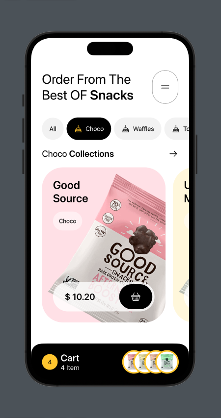
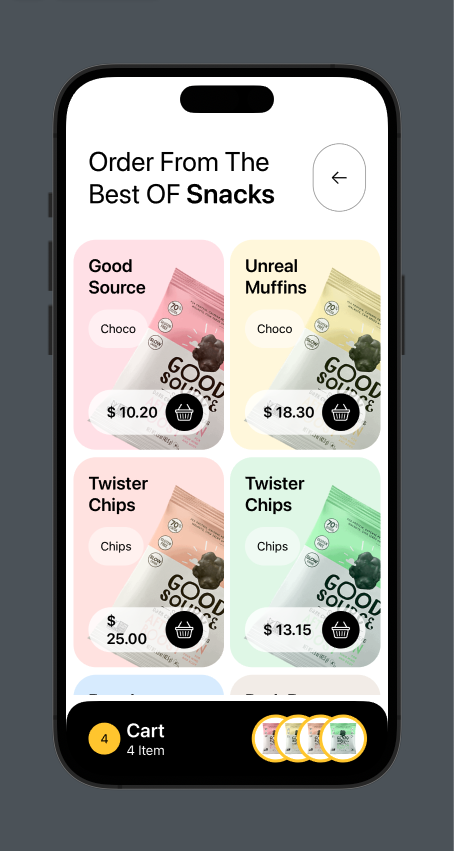
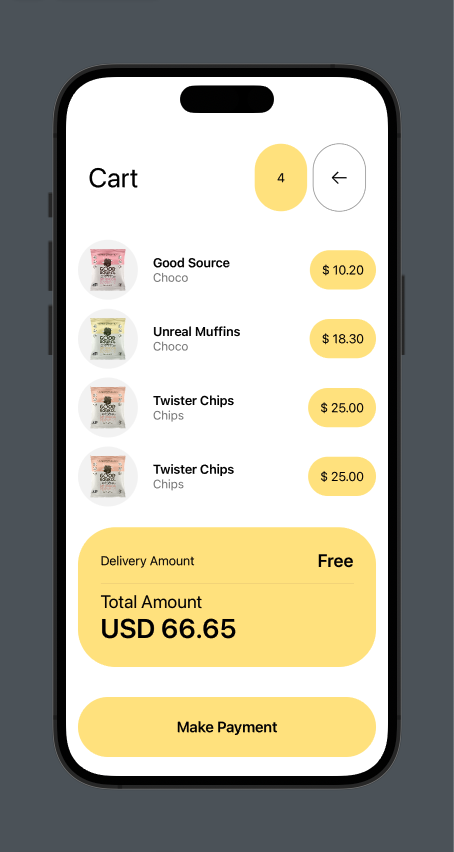

## Snacks App

Snacks App was built in SwiftUI for study purposes, it has three screens, Home, Collection and Cart.

https://github.com/Sup3r-Us3r/snacks-app/assets/22561893/46c98d7d-2aac-492a-9f37-f5a09f161a7d

## Screenshots

## Exemplo de Tabela Vertical com Imagem

|                    Home                     |                    Collections                     |                    Cart                     |
| :-----------------------------------------: | :------------------------------------------------: | :-----------------------------------------: |
|  |  |  |
